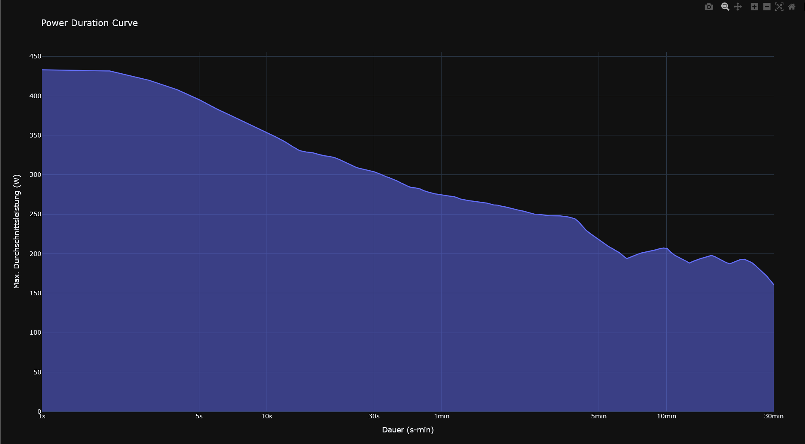
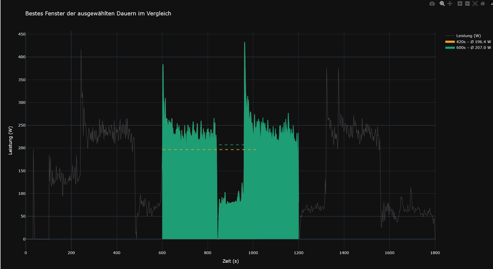

# Power Curve advanced

> A Python module for computing and visualizing the power-duration curve from cycling activity data.

---

## Table of Contents

- [About the Project]
- [Requirements]
- [Installation]
- [Usage]
- [Project Structure]
- [Dependencies]
- [License]
- [Authors]

---

## About the Project

This project computes the **Power-Duration Curve** (also known as the Best Average Power curve) from cycling activity data.

The module `advanced_powercurve.py` reads power data in Watt from a CSV file and calculates, for each duration, the highest average power the athlete was able to sustain. The durations are distributed logarithmically, giving more resolution at longer efforts where meaningful differences occur.

Additionally, the module includes a **window comparison tool** that plots the raw power data and highlights the best intervals for two given durations side by side — useful for verifying the correctness of the curve and understanding why, for example, the 10-minute best can be higher than the 7-minute best.




---

## Requirements

- Python >= 3.13
- uv
- Git

---

## Installation

### Install uv

**Windows (PowerShell):**
```powershell
powershell -ExecutionPolicy ByPass -c "irm https://astral.sh/uv/install.ps1 | iex"
```

**macOS / Linux:**
```bash
curl -LsSf https://astral.sh/uv/install.sh | sh
```

### Clone the Repository

```bash
git clone <https://github.com/tjenewein/programmieren_2_aufgabe_2-4.git>
```

### Install Dependencies

```bash
uv sync
```

This will:

- Install all Python dependencies
- Create a virtual environment automatically
- Use the exact versions defined in `uv.lock`

---

## Usage

Run the analysis:

```bash
uv run python advanced_powercurve.py
```

This will:

1. Read the power data from `data/activities/activity.csv`
2. Compute the Power-Duration Curve
3. Display the Power-Duration Curve plot
4. Display the window comparison plot (7 min vs. 10 min) for verification

---

## Project Structure

```
PROGRAMMIEREN_2_AUFGABE_2-4/
│
├── data/
│   ├── activities/
│   │   └── activity.csv            # Activity / power sensor data
│   ├── ekg_data/                   # Raw ECG recordings
│   ├── pictures/                   # Profile pictures of test subjects
│   └── person_db.json              # Personal data of test subjects
│
├── advanced_powercurve.py          # Power-Duration Curve module + entry point
├── advanced_powercurve_ReadMe.md   # README for the Power Curve module
├── interactive_plot.py             # Streamlit tabs: ECG + Power/HR zones
├── load_data.py                    # Data loading helpers
├── read_pandas.py                  # CSV / dataframe utilities
├── main.py                         # Streamlit entry point — person selection
├── Power_Hr_Screen.png             # Screenshot of the Power/HR zone plot
│
├── pyproject.toml                  # Project configuration
├── uv.lock                         # Lockfile
├── .gitignore
├── .python-version
├── vergleich.png
├── adv_pow_curve.png
└── README.md
```

---

## Dependencies

All dependencies are defined in `pyproject.toml`. Key packages include:

- **pandas** — data handling
- **plotly** — interactive plotting
- **numpy** — numerical computations

Install them automatically with `uv sync`.

---

## License

No License

---

## Authors

Matteo Harasser
Jeremias Koller
Thomas Jenewein